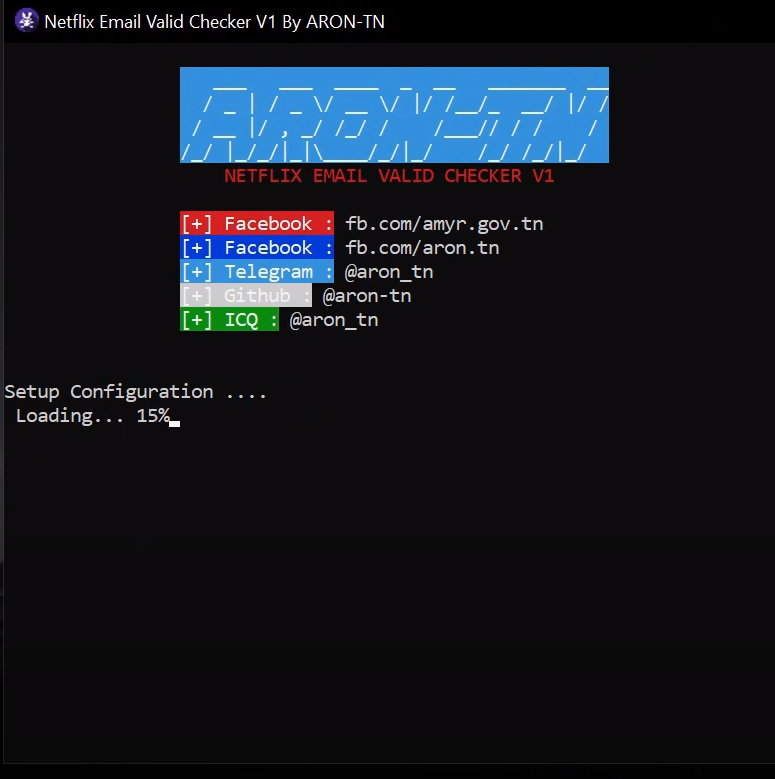
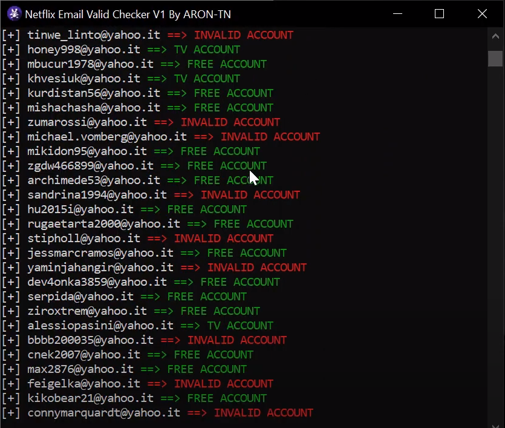

# Netflix Email Valid Checker
<p align="center">
  
</p>

*Useful?*
----
```
Yes .. You can see : 
* Premium Accounts
* Free Accounts
* TV Accounts
* Invalid Accounts
```
*using*
----
**Windows**
```
Python Required Version : https://www.python.org/downloads/release/python-391/
Click on "Netflix Email Valid Checker v1.exe"
```

*Screenshots*
----

<p float="left">
  
   
</p>
